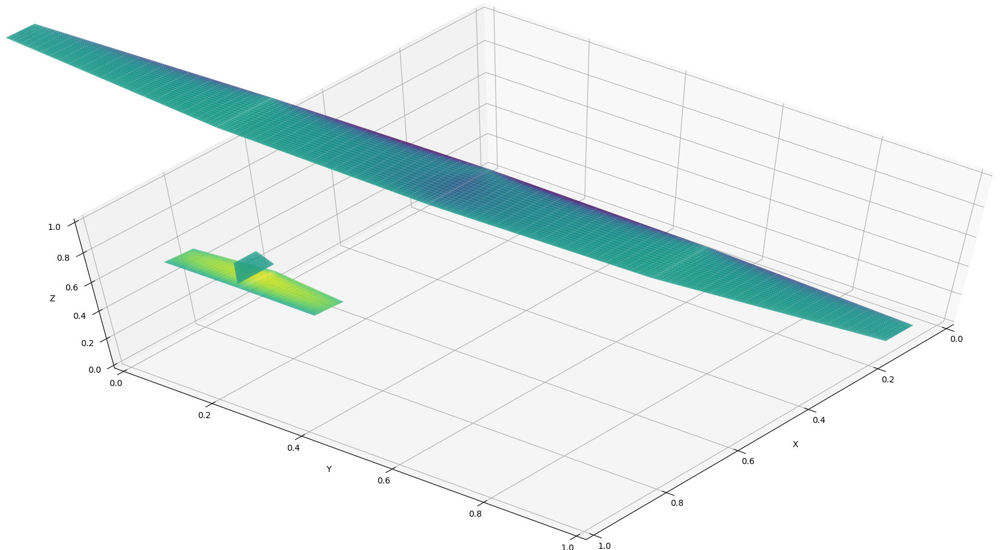
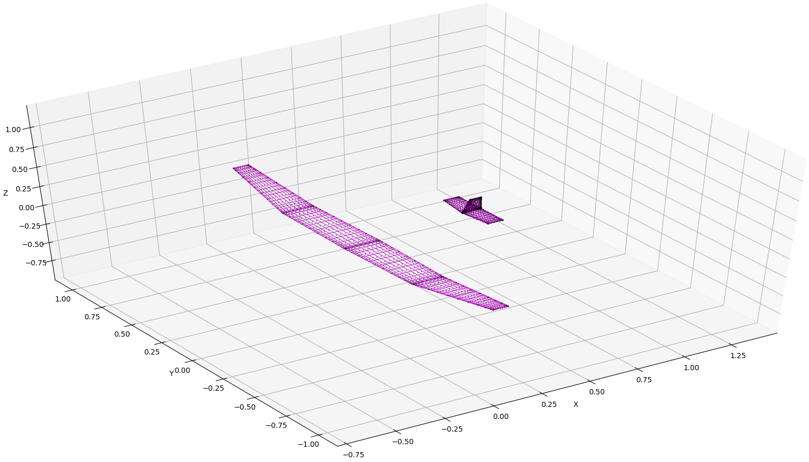

# AeroSandbox
by Peter Sharpe

A sandbox for playing around with aerodynamics ideas related to vortex lattice methods, coupled viscous/inviscid methods, automatic differentiation for gradient computation, aircraft design optimization, and the like.

## Purpose
My primary purpose for this repository is to teach myself methods for aerodynamic analysis, develop new methods, and explore these principles within a unified code base. As such, the current focus of this library is not at all on documentation. That may change at some point in the future. It's also very possible that this repository will never reach a release-ready state and will remain no more than a sandbox.

## Future Goals
In descending order of priority/feasibility:
* Implement a traditional VLM (a la XFLR5's VLM1) for simulating multiple thin lifting surfaces.
* Implement a viscous drag buildup on wings from interpolated 2D XFOIL data (a la XFLR5's method for approximation of viscous drag).
* Implement a hybrid ring/horseshoe vortex VLM (a la XFLR5's VLM2) for simulating multiple thin lifting surfaces (hopefully with improved speed and robustness over the VLM1 approach).
* Implement a viscous drag buildup on nearly-axisymmetric bodies (using the method detailed in Drela's TASOPT v2.00 documentation, Appendix E)
* Perhaps consider implementing a free-wake compatible VLM model?
* Implement an inviscid 3D panel method for simulating multiple objects of arbitrary thickness.
* Make the aforementioned 3D panel method able to use triangular panels, add VTK or .stl compatibility for panel handling.
* Implement a 2.5D coupled viscous/inviscid method directly using the viscous methods described in Drela's paper "Viscous-Inviscid Analysis of Transonic and Low Reynolds Number Airfoils". Inviscid flow would be fully 3D, while viscous flow would make the assumption of negligible spanwise flow.
* Implement a fully 3D coupled viscous/inviscid method, compatible with triangular panels (a la Drela's IBL3 approach detailed in his paper "Three-Dimensional Integral Boundary Layer Formulation for General Configurations"). Ideally, the trailing edge stagnation points will be automatically identified, and nothing more than a surface triangulation along with freestream conditions will be required to compute forces and moments.

## Usefulness
AeroSandbox attempts to improve over existing conceptual-level aerodynamics tools. The following strengths and weaknesses are identified with existing tools, based purely off the author's experience:

Strengths:
* XFLR5: Reliability, speed, accuracy, visualization
* AVL: Reliability, speed, accuracy, scriptability
* Tornado: Implementation in a high-level language
* VSPAero: Rapid CAD/geometry integration, geometric flexibility

Weaknesses:
* XFLR5: Lack of scriptability, limited geometric flexibility
* AVL: Lack of object-oriented structure
* Tornado: Speed, user-friendliness
* VSPAero: Robustness, speed, accuracy, and reliability

With any luck, the list of strengths and weaknesses here will help to drive AeroSandbox development to retain positive qualities and eliminate negative ones.

## License

MIT License

Copyright (c) 2019 Peter Sharpe

Permission is hereby granted, free of charge, to any person obtaining a copy
of this software and associated documentation files (the "Software"), to deal
in the Software without restriction, including without limitation the rights
to use, copy, modify, merge, publish, distribute, sublicense, and/or sell
copies of the Software, and to permit persons to whom the Software is
furnished to do so, subject to the following conditions:

The above copyright notice and this permission notice shall be included in all
copies or substantial portions of the Software.

THE SOFTWARE IS PROVIDED "AS IS", WITHOUT WARRANTY OF ANY KIND, EXPRESS OR
IMPLIED, INCLUDING BUT NOT LIMITED TO THE WARRANTIES OF MERCHANTABILITY,
FITNESS FOR A PARTICULAR PURPOSE AND NONINFRINGEMENT. IN NO EVENT SHALL THE
AUTHORS OR COPYRIGHT HOLDERS BE LIABLE FOR ANY CLAIM, DAMAGES OR OTHER
LIABILITY, WHETHER IN AN ACTION OF CONTRACT, TORT OR OTHERWISE, ARISING FROM,
OUT OF OR IN CONNECTION WITH THE SOFTWARE OR THE USE OR OTHER DEALINGS IN THE
SOFTWARE.
